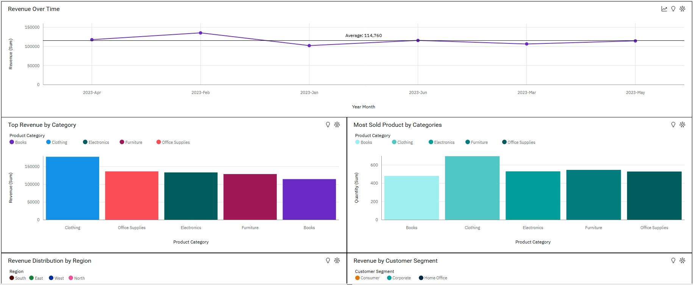

# 📊 E-commerce Sales Dashboard – IBM Cognos Analytics

This project uses a sample E-commerce dataset to build an interactive business intelligence dashboard using *IBM Cognos Analytics*.

## 📁 Dataset Overview
Columns include:
- Order ID
- Order Date
- Customer Name
- Region
- Product
- Category
- Quantity
- Unit Price
- Total Sales

## 📊 Visual Insights
1. *Revenue Over Time*:
   - Feb 2023 had the highest revenue ($135K), followed by April ($117K).

2. *Revenue by Region*:
   - *North* performed best ($195K), followed by *West* ($188K).

3. *Top-Selling Products (Quantity)*:
   - *Clothing* leads with 695 units sold.

4. *Revenue by Customer Segment*:
   - *Corporate* is the top revenue generator but ranked #2 in average unit price.

## 💡 Personal Note
> The first time I opened IBM Cognos, I was lost and gave up that day.  
> But the next day, I came back with focus and said:  
> *"I will never give up."*

## 🤖 Tools Used
- IBM Cognos Analytics (Dashboard + Visualizations)
- Data Cleaning (Preprocessing in Excel)
- Business Intelligence Thinking

## 🔗 View Dashboard

## 🔍 Dashboard Preview

